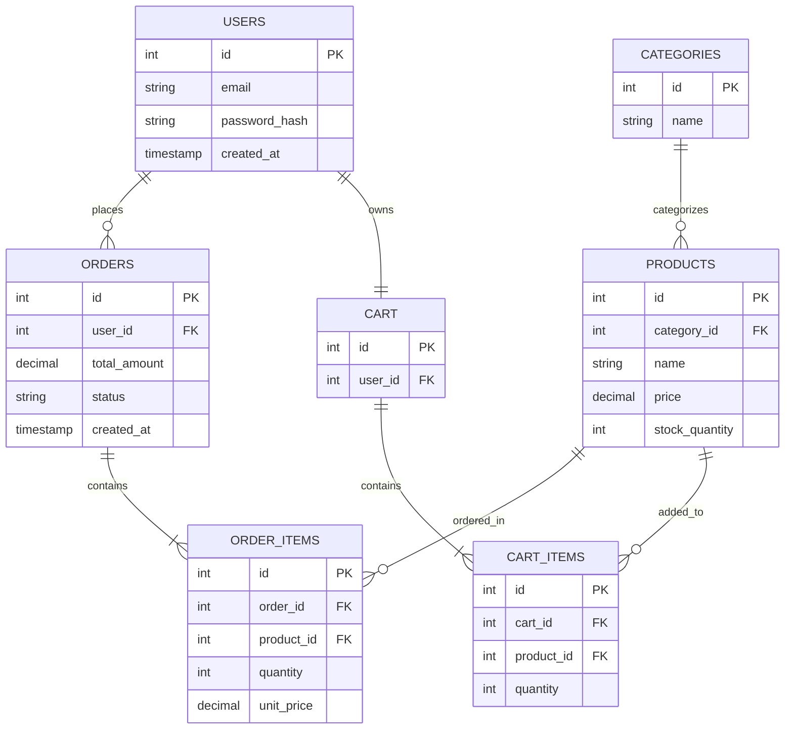

# Sprint 1: System Architecture & Scope Definition

## Section 1: Target Audience & Market Focus

**Primary Persona:**
Riya, 24–35 years old, a budget-conscious urban retail consumer who shops online for everyday goods on her phone during commutes or breaks. She is comfortable with digital payments but has low patience for slow checkouts, unclear stock availability, or clunky search.

**Core Pain Point:**
Existing small-scale retail sites in this niche either lack real-time inventory accuracy (leading to canceled orders after payment) or have search/filtering that is too shallow to narrow down products quickly, causing users to abandon their cart before checkout.

**Domain Scope:**
Consumer Electronics Accessories (phone cases, chargers, earphones, small gadgets) — a vertical chosen because catalog size is naturally bounded, product attributes (brand, compatibility, color) map cleanly to filterable taxonomy, and the domain is realistic to fully implement within a single academic semester.

---

## Section 2: MVP Feature Scope Matrix

| Category | Feature Name | Description | Priority |
|---|---|---|---|
| Authentication | User Registration & Authentication | Password hashing (bcrypt) and JWT-based session authentication for signup/login. | High (MVP) |
| Catalog | Product List & Search | Product browsing interface with category and attribute-based (brand, price range, compatibility) filtering. | High (MVP) |
| Cart | Cart Management | State-persistent cart management: item addition, quantity modification, and deletion, tied to the user's account. | High (MVP) |
| Checkout | Order Processing | Mock/Stripe test-mode payment gateway integration and order object instantiation with status tracking. | High (MVP) |
| Admin | Inventory Control | Administrative CRUD operations for product and stock-quantity management. | Medium |
| Account | Order History | Authenticated users can view past orders and their current status. | Medium |

**Feasibility note:** The four High (MVP) features form the minimum functional loop (browse → cart → pay → order created) required for the app to be usable end-to-end; the two Medium features extend it without expanding scope into areas (e.g., reviews, recommendations, multi-vendor support) that would be infeasible for a solo build in one semester.

---

## Section 3: Tech Stack Selection & Justification

- **Frontend Framework: React (with Vite)**
  Justification: React's component model fits the catalog/cart/checkout UI split naturally, and its ecosystem (React Router, Context/Redux for cart state) is well-documented for a solo developer working under a deadline, compared to the steeper initial configuration overhead of a full Next.js SSR setup that isn't needed for this project's SEO-light scope.

- **Backend Infrastructure: Node.js / Express**
  Justification: Express keeps the API layer lightweight and lets the same language (JavaScript) be used across frontend and backend, reducing context-switching for a single developer; its middleware model also maps cleanly onto JWT auth and request validation without the heavier conventions of a framework like Spring Boot or Django, which offer scalability benefits not needed at this project's scale.

- **Database Management System: PostgreSQL**
  Justification: The domain (users, products, orders, order items) is inherently relational, with strict integrity needs around order-to-product references and quantities — a good fit for PostgreSQL's strong constraint/foreign-key enforcement and transactional guarantees, versus a document store like MongoDB, which would require re-implementing referential integrity in application code.

- **Caching & Asynchronous Processing (Optional): Redis**
  Justification: Redis is used to cache product catalog reads (reducing repeated DB load on the search/browse endpoints) and to store cart session data for fast reads/writes during active shopping sessions.

---

## Section 4: Entity-Relationship Diagram (ERD)

### Cardinality & Relationships

- **Users → Orders**: 1:N (one user places many orders)
- **Users → Cart**: 1:1 (one active cart per user)
- **Cart → Cart_Items**: 1:N
- **Products → Cart_Items**: 1:N
- **Orders → Order_Items**: 1:N
- **Products → Order_Items**: 1:N
- **Categories → Products**: 1:N

### Attribute Definitions & Keys

| Entity | Attribute | Type | Key |
|---|---|---|---|
| Users | id | INTEGER | PK |
| Users | email | VARCHAR(255) | — |
| Users | password_hash | VARCHAR(255) | — |
| Users | created_at | TIMESTAMP | — |
| Categories | id | INTEGER | PK |
| Categories | name | VARCHAR(100) | — |
| Products | id | INTEGER | PK |
| Products | category_id | INTEGER | FK → Categories.id |
| Products | name | VARCHAR(150) | — |
| Products | price | DECIMAL(10,2) | — |
| Products | stock_quantity | INTEGER | — |
| Cart | id | INTEGER | PK |
| Cart | user_id | INTEGER | FK → Users.id |
| Cart_Items | id | INTEGER | PK |
| Cart_Items | cart_id | INTEGER | FK → Cart.id |
| Cart_Items | product_id | INTEGER | FK → Products.id |
| Cart_Items | quantity | INTEGER | — |
| Orders | id | INTEGER | PK |
| Orders | user_id | INTEGER | FK → Users.id |
| Orders | total_amount | DECIMAL(10,2) | — |
| Orders | status | VARCHAR(50) | — |
| Orders | created_at | TIMESTAMP | — |
| Order_Items | id | INTEGER | PK |
| Order_Items | order_id | INTEGER | FK → Orders.id |
| Order_Items | product_id | INTEGER | FK → Products.id |
| Order_Items | quantity | INTEGER | — |
| Order_Items | unit_price | DECIMAL(10,2) | — |

### Mermaid ERD

